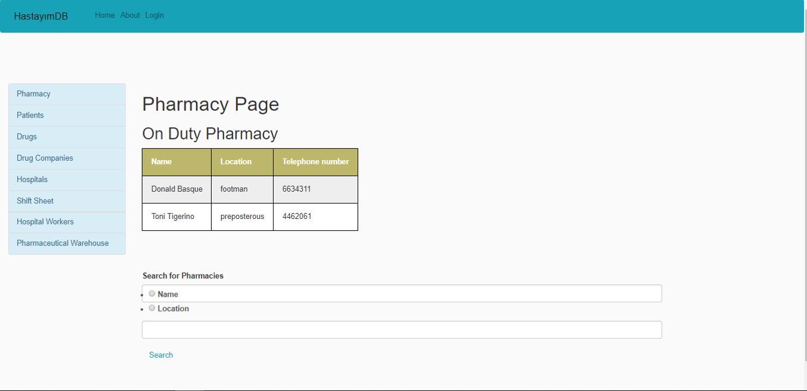
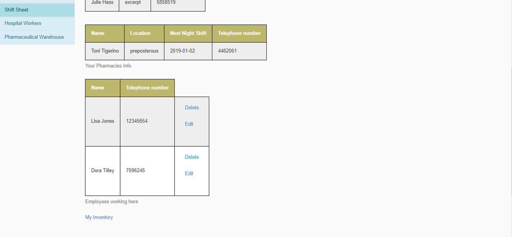
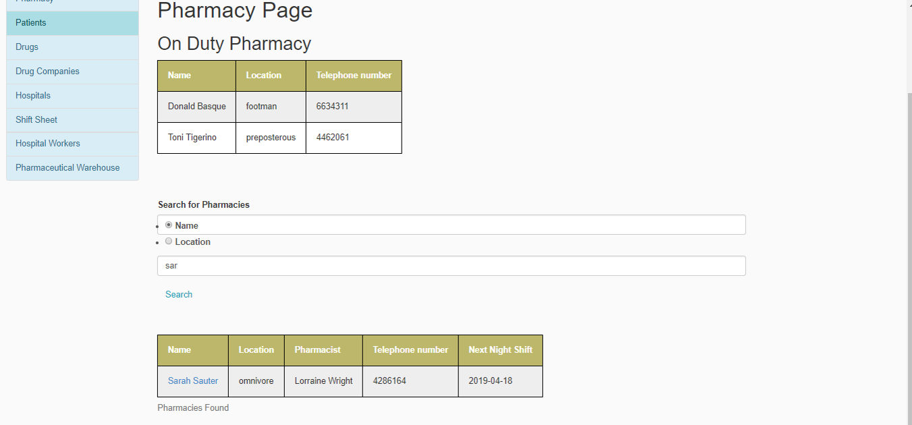
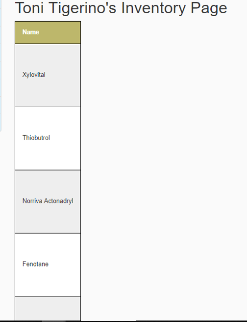
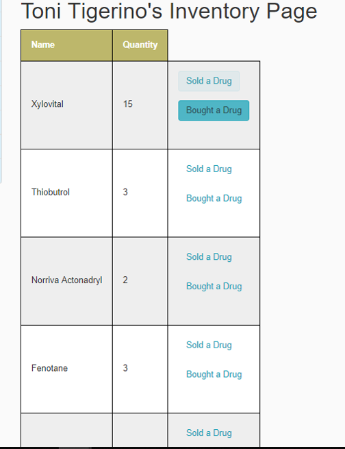

Parts Implemented by Atakan Göl
================================

This page will be providing information on

* *Pharmacy Page*
* *Pharmaceutical Warehouse Page*
* *Inventory Page*

1. Pharmacy Page
----------------

Pharmacies page is for on duty pharmacies, searching for pharmacies.
And if you are logged in using a pharmacy’s credential it is for more detailed information about your pharmacy and it's employees.
This page also leads to inventory pages which will be explained later.

    Default view for Pharmacies Page

    Pharmacies Page when logged in

1.1 Search Option
~~~~~~~~~~~~~~~~~

Users can search for pharmacies either by name or location.
when searched, user is given a list of pharmacies according to the search.
This list also contains links for their inventory pages.

    Searching for Pharmacies

2. Pharmaceutical Warehouse Page
--------------------------------

Similar to the pharmacy page, this page is for searching warehouses and leads to their inventories.
If someone is logged in using a pharmaceutical warehouse credential they can see more details about their warehouse

2.1 Search Option
~~~~~~~~~~~~~~~~~

Users can search for pharmaceutical warehouses either by name or location.
when searched, user is given a list of pharmaceutical warehouses according to the search.
This list also contains links for their inventory pages.

3. Inventory Page
-----------------

This page is for viewing either someone's inventory or for yourself.
If you are viewing your own inventory you can also edit the number for every drug in you inventory.

3.1 Someone Else's Page
~~~~~~~~~~~~~~~~~~~~~~~

Here you can check if a pharmacy have the drug you are looking for.
Or if you are a pharmacist you can look for drugs to order from certain pharmaceutical warehouses.

    Someone Else's Page

3.2 Your Own Page
~~~~~~~~~~~~~~~~~

Here you can check your own inventory and and edit how much of a drug you have.

    Your Own Page

    