Parts Implemented by Ayser Ecem Konu
====================================

This page will be providing information on

* *Hospitals*
* *Hospital Workers*

* *Shift Sheet*

1. Hospitals
--------------

Hospital page is available for get methods as every user, however adding, deleting
and editing is only limited to admin and the hospital administrator.

Navigate to Hospitals page by clicking the *HOSPITALS* button on sidebar.

Performing operations on hospitals requires admin logins specified as above.

.. tip:: Enter with admin to see add page, delete options and edit, if you're not an admin, trying to access these pages will redirect you into home page.

A search form exists in hospitals page to further allow user to search for an hospital matching required criterias.
If no selection is done, search will return all entries.

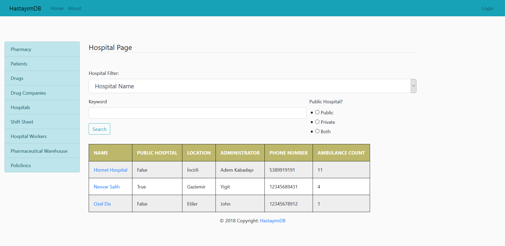

    Hospitals Page Without Login

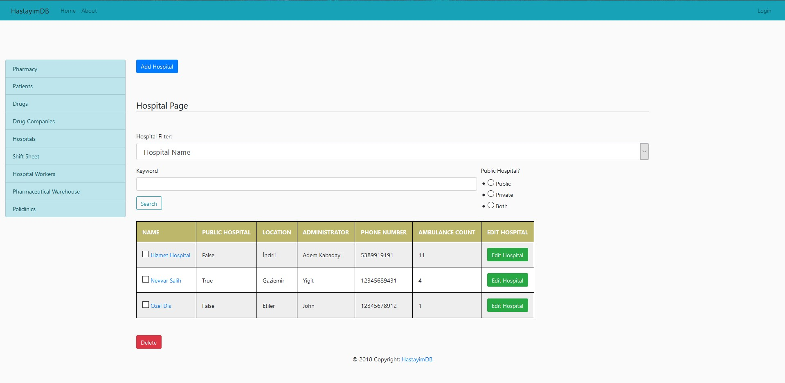

    Hospitals Page With Login

If a click is performed on hospital name in the table, it will redirect user into hospital personnel workingg in that hospital

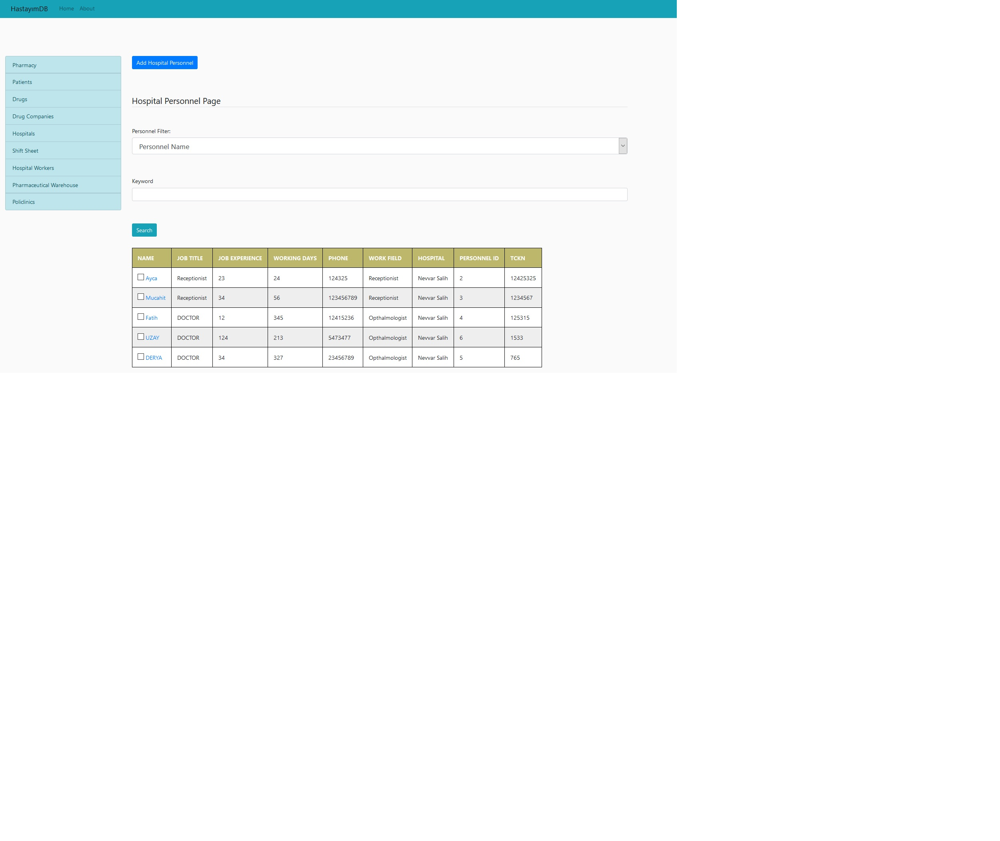

    Personnel of the Specified Hospital

1.1 Adding a New Hospital
~~~~~~~~~~~~~~~~~~~~~~~~~~~~

If login to page has been done and the session matches given constraints, a link
for add page will be visible in the hospitals page.

.. figure:: ecem/hospital_add_page.jpg
:scale: 40%
    :alt: Hospital Add Page With Login
    :align: center

    Hospital Add Page

.. warning:: If an unwanted access is done to add page using link, it will redirect user into homepage.

1.2 Updating an Existing Hospital
~~~~~~~~~~~~~~~~~~~~~~~~~~~~~~~~~~~~~~~~

From hospital page, edit hospital button can be pressed, once pressed, if session matches given constraints
following page will be visible.

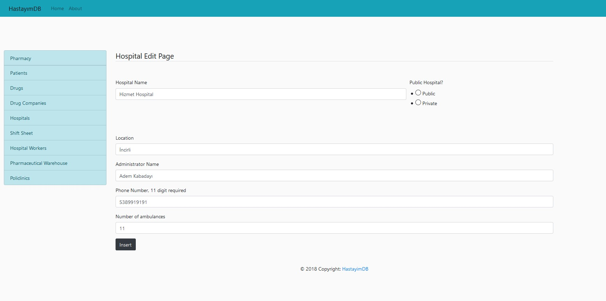
:scale: 40%
    :alt: Hospital Edit Page With Login
    :align: center

    Hospital Edit Page

..warning:: If an unwanted access is done to add page using link, it will redirect user into homepage.

..warning:: If radiobox is not checked, edit operation will not work.

1.3 Deleting an Existing Hospital
~~~~~~~~~~~~~~~~~~~~~~~~~~~~~~~~~~~~~~~

Checkbox beside name of the hospital can be checked by specified users. If checkbox is checked and delete button is pressed
selected entry can be deleted from the database.

2. Hospital Personnel
---------------------

Navigate to the Hospital Personnel page by clicking the *Hospital Workers* button on the sidebar to the left.

In order to perform add, delete and edit, login status must match of admin, hospital administrator or the hospital secretary.

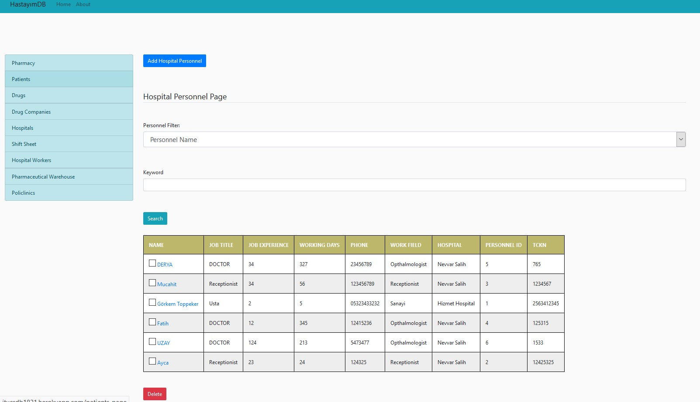

    Hospital Personnel Page with Login

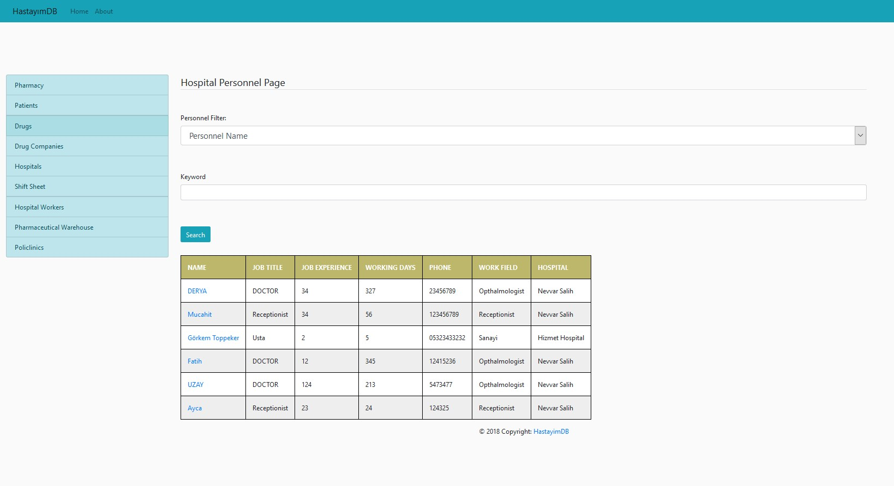

    Hospital Personnel Page without Login

.. note:: Hospital Id is not shown to unauthorized users to protect database related information.

Searching through hospital personnel is allowed using existing form in Hospital Personnel page.

2.1 Adding a New Hospital Personnel
~~~~~~~~~~~~~~~~~~~~~~~~~~~~~~~~~~~~~~~~

Following the Add Hospital Personnel button from Hospital Personnel page will redirect specified user into 
Hospital add can be done by filling following forms and then clicking insert button below forms.

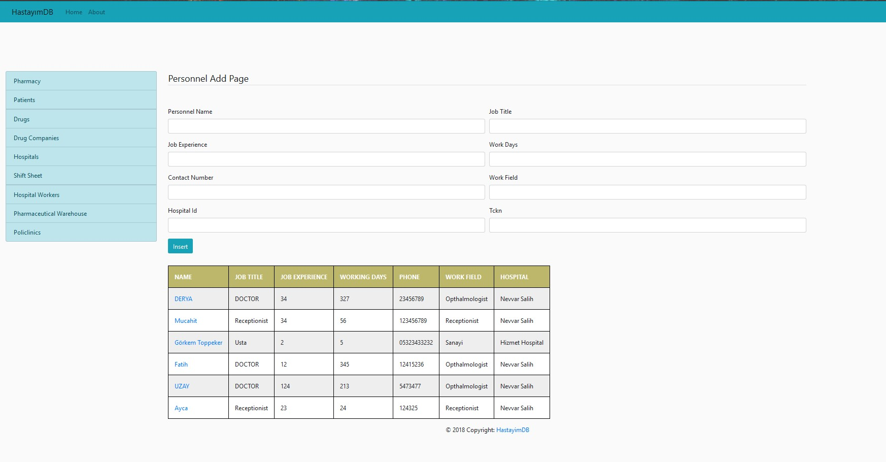
    
    Hospital Personnel Add Page

.. note::Unregistered access using link will redirect user to homepage.

2.2 Update an Existing Hospital Personnel
~~~~~~~~~~~~~~~~~~~~~~~~~~~~~~~~~~~~~~~~~~~~~

If an hospital personnel entry is clicked from hospital personnel page and the login was done as specified,
hospital personnel edit page will be shown to user.

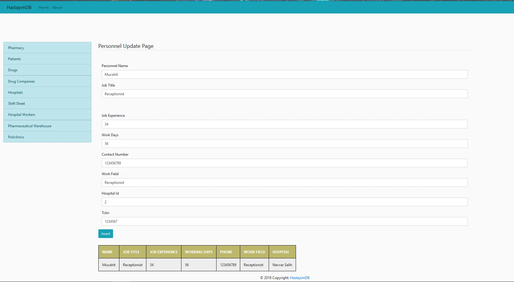
    
    Hospital Personnel Edit Page

.. note:: Data of the personnel to edit is inserted to forms to make editing more accessable.

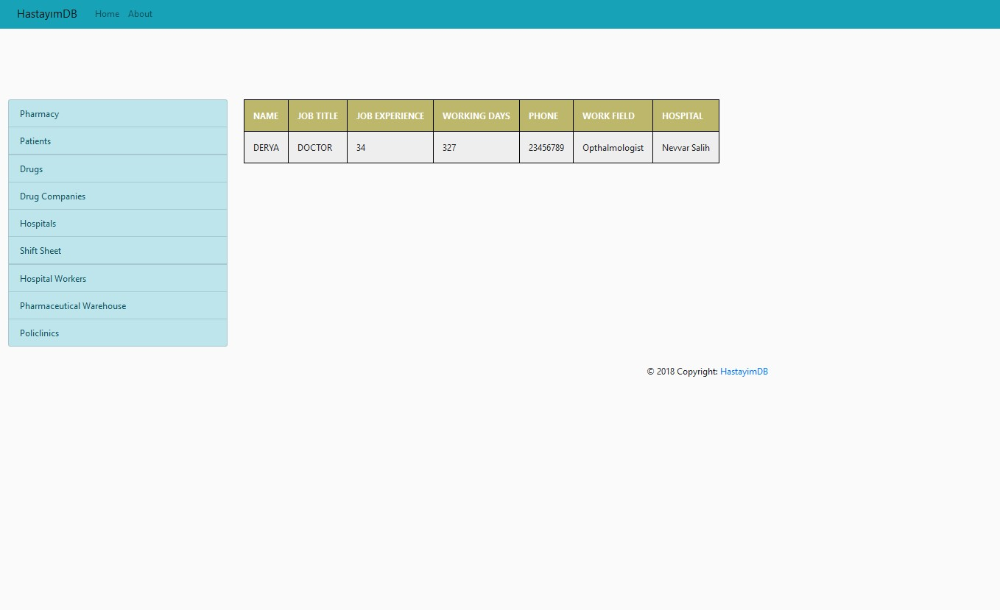
    
    Hospital Personnel Edit Link without Correct Session

2.3 Delete an Existing Hospital Personnel
~~~~~~~~~~~~~~~~~~~~~~~~~~~~~~~~~~~~~~~~~~~~~

Deleting an Existing Hospital Personnel can be done by clicking checkboxes beside entries to delete, 
then pressing the delete button. Multiple deletion is allowed if wanted.

3. Shift Table
---------------

Hospitals generally have tables that show who will be taking shifts in the emergency areas.

Navigate to Shift Table using *Shift Sheet* button on the sidebar to the left.

Adding new entries to shift page can be done using form given in Shift Table page.

3.1 Adding a New Shift to Table
~~~~~~~~~~~~~~~~~~~~~~~~~~~~~~~~~~~

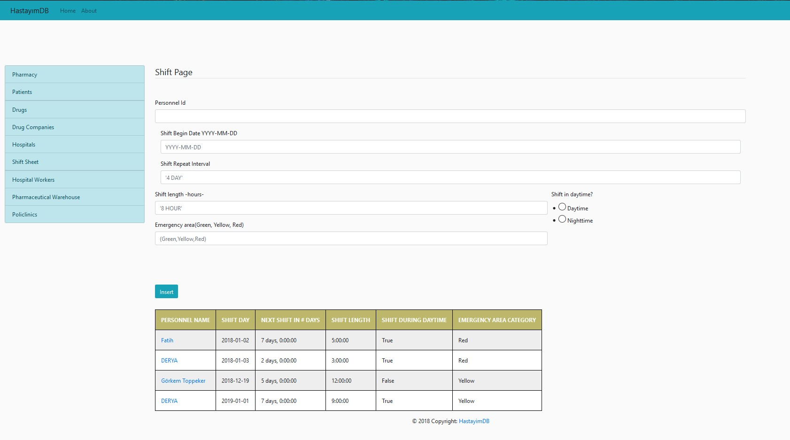
    
    Adding New Shifts

3.2 Deleting a Shift from Table
~~~~~~~~~~~~~~~~~~~~~~~~~~~~~~~~~~~~~~~~

If session is matches with administrator or hospital administrator, delete checkboxes will
also be visible to user.

Select checkboxes of entries to delete, then press delete button to delete entries.

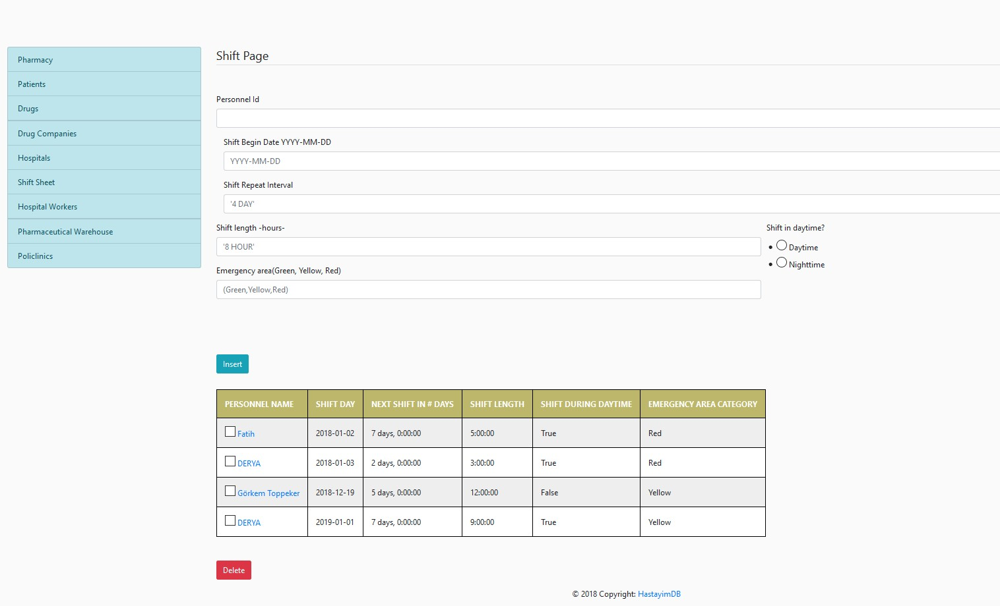
    
    Deleting a Shift from Table